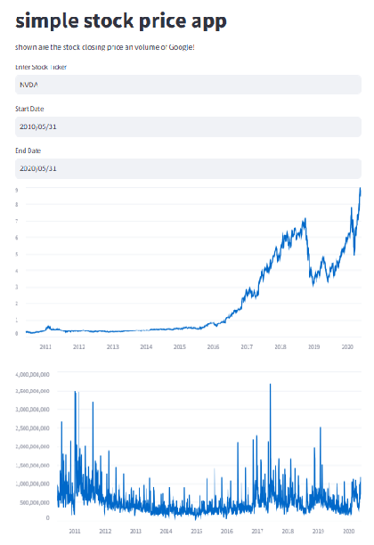

# Portfolio
---

## Deep Learning

### <ins>Master's Thesis</ins>: *"State parameter estimation of Li-ion battery using Deep Neural Networks and Equivalent circuit model"*  

_Key Skills: Python (PyTorch, scikit-learn, fastai, PyBamm), `Matlab and Simulink, Battery modelling, Battery testing, BMS_

---
### Natural Language Processing using NLTK

_Key Skills: Python (nltk, pandas)_ 

  

converting paragraph into sentences and words. Perform tokenization, stemming, lemmatization and use sklearn's CountVectorizer to make bag of words.

  

---

### Stock Price Visualization App  

_Key Skills: Python (yfinance, Streamlit, pandas), Financial Data Analysis, Time-Series Visualization, API Integration_ 

  
A <b>web-based stock price visualization tool</b> that retrieves and displays <b>historical stock data</b> using <b>yFinance</b> and <b>Streamlit</b>. The app allows users to analyze <b>closing prices and trading volumes</b> of stocks, with a default focus on <b>Google (GOOGL)</b>.  
   
The project features an <b>interactive interface</b> where users can enter stock tickers, select date ranges, and generate <b>real-time time-series charts</b>. It leverages <b>yfinance</b> for retrieving financial data, <b>pandas</b> for data manipulation, and <b>Streamlit</b> for building an interactive UI.

  
   

  
   

---

© 2025 Amrit Dhakal. Powered by Jekyll and the Minimal Theme.

